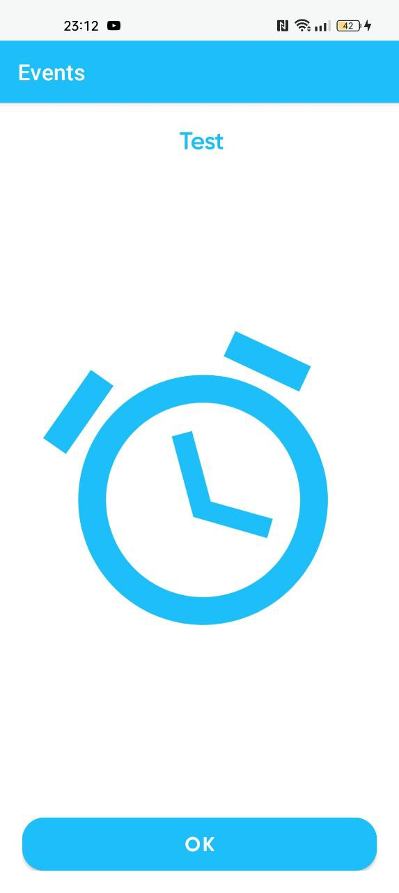

# Event Notification

## About

Event Notification is an android application that provides the ability to create events for different dates with further mention of them. The mention is made using a sound like an alarm clock. The application allows you to set the time until the first mention, the sound that will be played at the notification

## Screenshots

| Create Event | Calendar Events | Edit Event |
|------------|------------|------------|
|  |  |  |

| Settings | Notification |
|------------|------------|
|  | 

## Features

### Build With

- **Hilt Dependency Injection:** Utilizes Hilt for dependency injection to manage dependencies, enhancing code quality, maintainability, and scalability.
- **Room:** Implements Room for working with SQLite databases, improving performance and ensuring security in database operations.
- **Coroutines:** Employs Coroutines for writing asynchronous code, enhancing the efficiency of asynchronous tasks.
- **DataStore Preferences:** Utilizes DataStore Preferences for storing application settings, providing a modern approach to data storage.
- **Navigation Component:** Implements the Navigation Component to facilitate navigation within the application, enhancing the overall user experience.
- **Kizitonwose Calendar:** Incorporates Kizitonwose Calendar to implement a feature-rich calendar in the application.
- **Android SpinKit:** Integrates Android SpinKit to implement a loading spinner icon, improving the visual feedback during loading processes.
- **Flow:** Utilizes Flow to efficiently manage asynchronous data streams, enhancing the application's responsiveness and facilitating the handling of data changes.
- **ViewModel** - Stores UI-related data that isn't destroyed on UI changes.
- **ViewBinding** - Generates a binding class for each XML layout file present in that module and allows you to more easily write code that interacts with views.

### Package Structure
```
  alertofevents
  |
  └── Root Package.
  .
  |
  ├── base
  |   |
  |   └── ui
  |       |
  |       └── Contains base classes and utilities for the user interface.
  |
  ├── common
  |   |
  |   ├── converters
  |   |   |
  |   |   └── Provides converters for various data types.
  |   |
  |   ├── database
  |   |   |
  |   |   └── Manages common database-related functionality.
  |   |
  |   ├── extension
  |   |   |
  |   |   └── Includes extension functions for Kotlin.
  |   |
  |   └── ui
  |       |
  |       └── Holds common UI components and utilities.
  |
  ├── data
  |   |
  |   ├── cache
  |   |   |
  |   |   ├── entity
  |   |   |   |
  |   |   |   └── Defines entities for caching data.
  |   |   |
  |   |   └── mapper
  |   |       |
  |   |       └── Contains mappers to convert cache entities.
  |   |
  |   └── local
  |       |
  |       ├── dao
  |       |   |
  |       |   └── Includes Data Access Objects for local data access.
  |       |
  |       ├── entity
  |       |   |
  |       |   └── Defines entities for local data storage.
  |       |
  |       └── mapper
  |           |
  |           └── Contains mappers to convert local entities.
  |
  ├── di
  |   |
  |   └── Manages dependency injection setup using Hilt.
  |
  ├── domain
  |   |
  |   ├── interactor
  |   |   |
  |   |   └── Implements interactors for business logic.
  |   |
  |   └── model
  |       |
  |       └── Defines data models for the domain.
  |
  └── ui
      |
      ├── calendarEvents
      |   |
      |   └── Manages UI components for calendar events.
      |
      ├── event
      |   |
      |   └── Handles UI components related to events.
      |
      ├── main
      |   |
      |   └── Contains main UI components and screens.
      |
      ├── notification
      |   |
      |   └── Manages UI components for notifications.
      |
      └── settings
          |
          └── Handles UI components related to application settings.
```

### Architecture

This app uses **MVVM (Model View View-Model)** architecture.

<div style="text-align: center">
 
</div>

### Contacts

- [Telegram](https://t.me/DrawableRes)
- [VK](https://vk.com/shiae)
- [Gmail](sven557929@gmail.com)